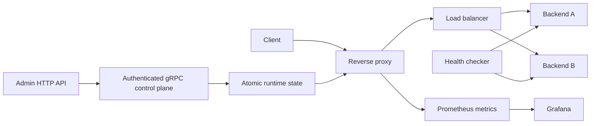

# Edge Proxy

[](https://github.com/ktrubilo9/edge-proxy/actions/workflows/ci.yml)
[](LICENSE)
[](#project-status)

Edge Proxy is an experimental, runtime-configurable edge security gateway written
in Go. It combines reverse proxy routing, atomic configuration updates, backend
health tracking, rate limiting, and Prometheus observability in a compact
codebase intended for research, learning, and open-source collaboration.

The long-term direction is a security-focused gateway with explainable adaptive
load balancing.

## Why Edge Proxy?

The project focuses on two areas that are useful to explore together:

- runtime security policies that can be updated without restarting the proxy;
- adaptive traffic distribution driven by measured backend behavior.

The current runtime publishes validated configuration snapshots atomically.
Requests either use the previous complete state or the next complete state,
without observing a partially applied update.

## Current Features

- Host-based and path-based reverse proxy routing.
- Optional path-prefix stripping.
- Least-connections load balancing.
- Active backend health checks and runtime backend status tracking.
- Authenticated HTTP admin API backed by an authenticated gRPC control plane.
- Atomic runtime configuration updates.
- Per-virtual-host rate limiting.
- Trusted-proxy-aware client IP resolution.
- Request IDs and forwarded request metadata.
- One retry on an alternate backend for retryable requests.
- Prometheus metrics and a provisioned Grafana dashboard.
- Docker Compose development environment with two mock backends.

## Planned Direction

The next development milestones focus on:

1. adaptive load balancing based on latency EWMA, error rate, active
   connections, backend health, and recovery behavior;
2. per-virtual-host IP allowlists and denylists;
3. configurable request size, URL, and header limits;
4. structured security decision logs;
5. JWT/OIDC authentication and authorization;
6. Coraza and OWASP Core Rule Set integration;
7. configuration schema versioning, JSON validation, and optional YAML support.

See [CONTRIBUTING.md](CONTRIBUTING.md) for ways to participate.

## Architecture



```text
cmd/
  admin-api/        HTTP API for runtime configuration
  mock-backend/     Demo backend used by Docker Compose
  reverse-proxy/    Main proxy process

internal/
  admin/            HTTP handlers and gRPC control plane
  api/              Protocol Buffers definition and generated Go code
  config/           Loading, validation, persistence, and snapshots
  health/           Backend health checking
  lb/               Load-balancing strategies
  metrics/          Runtime and Prometheus metrics
  middleware/       Request middleware and client IP resolution
  proxy/            Proxy runtime, orchestration, and handlers
```

## Quick Start

Requirements:

- Go 1.25 or newer, matching `go.mod`;
- Docker and Docker Compose for the complete local stack.

Create a local environment file:

```bash
cp .env.example .env
```

Replace the example secrets in `.env`, then start the stack:

```bash
docker compose up --build
```

The stack exposes:

| Service | Address |
| --- | --- |
| Reverse proxy | `http://localhost:8080` |
| Admin API | `http://localhost:8081` |
| Prometheus | `http://localhost:9090` |
| Grafana | `http://localhost:3000` |

Send a request through the configured virtual host:

```bash
curl -H "Host: app.example.local" http://localhost:8080/
```

Backends may remain unavailable briefly until the first health check succeeds.

## Configuration

The default configuration is stored in `configs/config.json`. Additional
examples are available in `configs/examples/`.

Values prefixed with `env:` are resolved from environment variables:

```json
{
  "url": "env:BACKEND1_URL",
  "weight": 1,
  "enabled": true
}
```

Important fields:

| Field | Purpose |
| --- | --- |
| `server.proxy_port` | Public proxy HTTP port |
| `server.admin_grpc_port` | Internal admin gRPC port |
| `load_balancing.strategy` | Load-balancing strategy; currently `least-connections` |
| `backends` | Upstream backend definitions with stable `id` values |
| `virtual_hosts` | Host-based routing policies using `backend_ids` |
| `path_routes` | Optional path-specific backend selection |
| `health_check` | Health-check interval, timeout, path, and status codes |
| `timeouts` | Outbound HTTP transport timeouts |
| `logging` | Log level and asynchronous logging settings |
| `security.policies` | Reusable security policies referenced by `security_policy_id` |

Runtime changes made through the admin API are persisted to the configured JSON
file. Mount that file as a volume when configuration must survive container
replacement.

## Admin API

Authentication is enabled by default. Configure separate HTTP and gRPC tokens:

```dotenv
ADMIN_AUTH_ENABLED=true
ADMIN_API_TOKEN=replace-with-a-random-value
ADMIN_GRPC_TOKEN=replace-with-another-random-value
```

Set `ADMIN_AUTH_ENABLED=false` only in an isolated local environment. The gRPC
token is always required, and the unencrypted gRPC transport must remain on a
trusted private network.

Main routes:

```text
GET|POST             /api/backend
GET|PUT|DELETE       /api/backend/{id}
GET|POST             /api/vhost
GET|PUT|DELETE       /api/vhost/{domain}
GET|PUT              /api/vhost/{domain}/security
GET                  /api/security/policies
PUT                  /api/security/policies/{id}
GET|PUT              /api/config/server
GET|PUT              /api/config/lb
```

Example:

```bash
curl http://localhost:8081/api/backend \
  -H "Authorization: Bearer $ADMIN_API_TOKEN"
```

## Observability

Prometheus scrapes the internal operational endpoint:

```text
http://reverse-proxy:9091/metrics/prometheus
```

The public proxy port exposes only a minimal `/health` response. Detailed
operational endpoints are kept on the internal `OPS_ADDR`.

When another proxy is placed in front of Edge Proxy, configure
`TRUSTED_PROXY_CIDRS` with only its network ranges. Forwarded client IP headers
from other peers are ignored.

## Development

Run the complete quality suite:

```bash
gofmt -l .
go vet ./...
go test ./...
go test -race ./...
```

Run the proxy outside Docker:

```bash
go run ./cmd/reverse-proxy
```

## Project Status

Edge Proxy is **pre-alpha**. It is suitable for local experiments, education,
benchmarking, and collaborative development. It has not completed a security
audit and should not be presented as a production-ready security boundary.

The project originated from an engineering thesis. The current repository is a
substantial refactor with a consolidated Go module, immutable configuration
snapshots, atomic runtime publication, a backend state registry, and a hardened
control plane. Historical adaptive load-balancing experiments will be
reproduced against this architecture.

## Contributing and Security

- Read [CONTRIBUTING.md](CONTRIBUTING.md) before opening a pull request.
- Use [GitHub Issues](https://github.com/ktrubilo9/edge-proxy/issues) for bugs
  and feature proposals.
- Report vulnerabilities according to [SECURITY.md](SECURITY.md), not through a
  public issue.

## License

Edge Proxy is available under the [MIT License](LICENSE).
